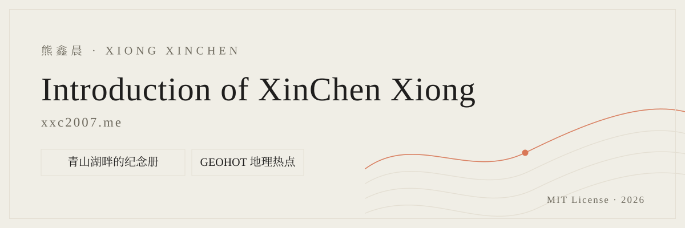

<sub>🌐 <a href="README.md">中文</a> · <b>English</b></sub>

<div align="center">

# Introduction of XinChen Xiong

> *"I haven't written code that changed the world yet."*

[](https://xxc2007.me/)
[](LICENSE)
[](#iii--stack)
[](#1--field)
[](#iv--run-locally)
[](#2--pages)
[](#3--state)
[](https://github.com/xxc2007)
[](https://www.douyin.com/user/MS4wLjABAAAA-AYW1RCpFjwJmoMTnZy1vKmOQopmBOUjPLN9phlDpjI)
[](https://www.xiaohongshu.com/user/profile/63bac6500000000026006c47)
[](https://space.bilibili.com/31961476)
[](https://x.com/xxc2007)
[](https://www.youtube.com/@xxc2007)

<br>

**Turn the things you have thought through, one by one, into addresses you can open.**

<br>

This is the personal introduction site of Xiong Xinchen (熊鑫晨): **two complete static pages** (Chinese and English), **five sections**, **two sites that are already live**, and one page of public contact details. The confetti field behind the hero is decoration, not content — without WebGL it falls back to two hairline rings and no text is lost.

Pure HTML / CSS / vanilla JS with structure, style and behavior separated (`index.html` + `assets/`), zero frameworks and **no build step**. Three.js and the serif font are self-hosted; neither page issues **a single external request**. Clone it, run `node tools/serve.mjs`, open it.

[Live site](https://xxc2007.me/) · [I Highlights](#i--highlights) · [II Site map](#ii--site-map) · [III Stack](#iii--stack) · [IV Run locally](#iv--run-locally) · [V Deploy and sync](#v--deploy-and-sync) · [VI Content rules](#vi--content-rules) · [VII License](#vii--license) · [VIII Star history](#viii--star-history) · [Design notes](docs/design.md) · [Migration guide](docs/migration.md) · [Content sources](docs/content-sources.md)

<br>

<!-- This row of counters is an entry point, not a second source of truth: the arithmetic, the
     commands and which numbers belong to which moment all live in "3 · STATE" below.
     Change that table and you change this row at the same time. -->

<p><b>At a glance</b></p>

[](#3--state)
[](#3--state)
[](#2--pages)
[](#3--state)
[](#iii--stack)
[](#3--state)

<sub>Measured locally 2026-10-07 09:35–09:53 (+0800) · the site is still being built, so file and byte counts move · xxc2007.me is the source of truth</sub>

</div>

---

<p align="center">
  
</p>
<p align="center"><sub>
  ▲ Banner · cream paper + one terracotta line + serif display type (no @import, no remote font request)
</sub></p>

---

## I · HIGHLIGHTS

### 1 · FIELD

- **One Three.js confetti field**: `Points` with a custom `ShaderMaterial`; particle caps of **1200 / 700 / 400** picked by pointer type and viewport width, device pixel ratio clamped to **1.75**, no textures (every mote is a soft disc computed from `gl_PointCoord` in the fragment shader)
- **Four colours only**: ink, paper, terracotta, hairline. About **8%** of the motes are terracotta; the rest sit at very low alpha — it is paper confetti, not fireworks
- **Deterministic**: seed `20070725`, zero `Math.random` in the file, so a screenshot of the field never drifts between runs
- **Two hard degradations**: the RAF loop is **stopped** (not throttled) when the hero leaves the viewport or the tab is hidden; if the 60-frame average exceeds **22 ms**, the particle count is halved once

The full effect → byte cost → fallback inventory lives in [docs/design.md](docs/design.md).

### 2 · PAGES

- **Two complete static pages**: `index.html` (zh-CN, default) and `en/index.html` (English). This is **not** a runtime dictionary switch — each page owns its semantics, `canonical` and SEO metadata
- Three `hreflang` alternates (`zh-Hans` / `en` / `x-default` → Chinese), **2** URLs in `sitemap.xml`, and `robots.txt` owned by this site for the whole domain root
- Alignment is enforced, not promised: `node scripts/check-parity.mjs` pins **10** structural counts and **5** sets (in-site assets, images, external links, in-page anchors, `id`s). Chinese and English disagreeing means the check **does not pass**

### 3 · STATE

| Item | Current value | How it was verified |
|---|---|---|
| Tracked files | **144** | `git ls-files \| wc -l` (it was 138 at 09:35; favicons, the og-card and an asset manifest landed in between) |
| Pages | **3** HTML files (zh / en / 404) | `git ls-files '*.html' \| wc -l` |
| Sections | **5** (`h2.sec-title`), **6** `<section>` elements | `node scripts/check-parity.mjs` |
| Live projects | **2**: the memorial at `/nc15/`, GEOHOT at `/geohot/` | Both entry points are on the page; routing table in [II](#ii--site-map) |
| Contact entry points | **7** (site / GitHub / Douyin / Xiaohongshu / Bilibili / X / YouTube) | Same command, `social li=7` |
| HTML size | **19.7 KB** per page (`20,170` / `20,195` bytes) | `node scripts/check-bytes.mjs` · `wc -c index.html en/index.html` |
| Site CSS | **32.3 KB** (`33,056` bytes) | `wc -c assets/css/style.css` |
| Hero JS | gzip **189.9 KB** against a 195.3 KB budget | `node scripts/check-bytes.mjs` |
| Self-hosted Three.js | `three.module.min.js` **338,908** B → gzip **79,328** B; `three.core.min.js` **381,124** B → gzip **101,305** B | `wc -c` + `node -e` with `zlib.gzipSync` |
| Self-hosted serif | **101** woff2 slices, **6,027,992** B in total | `find assets/fonts -name '*.woff2' \| wc -l` |
| External CDN requests | **0** | `grep -c 'src="https://' index.html en/index.html` → `0` on both pages |
| Build steps | **0** (no manifest in the repository) | `git ls-files '*.json' \| wc -l` → `0` |
| Above-the-fold images | `avatar.webp` 5,282 + `shot-nc15.webp` 28,624 + `shot-geohot.webp` 32,500 B = **64.8 KB** against an 87.9 KB limit → `BUDGET OK` | `node scripts/check-bytes.mjs` (the same line read **92.1 KB** and failed at 09:35; the shots were re-compressed inside those twenty minutes — treat no cell here as permanent truth) |
| Domain root | Target `/` = this site; **measured 2026-10-07** `/` still serves the memorial and `/nc15/` returns **404** | `curl -o /dev/null -w '%{http_code}' https://xxc2007.me/nc15/` · the switch command is `bash scripts/switch-routes.sh`, see [V](#v--deploy-and-sync) |

<!-- To be confirmed: the actual moment the root switch is executed, and the status codes after it. -->

Academic and study-related content does not enter this site, nor this README — the boundary is in [VI · Content rules](#vi--content-rules).

## II · SITE MAP

```text
Introduction-of-XinChen-Xiong/
├── index.html              # Simplified Chinese page (default); two inline blocks: noscript fallback styles + JSON-LD Person
├── en/index.html           # English page (a full translation, not runtime localisation; assets shared via ../)
├── 404.html                # Self-contained 404: zero scripts, inline styles, four live entry points listed
├── assets/
│   ├── css/style.css       # Tokens, components, 6 @media blocks (4 breakpoints + no-script + reduced motion)
│   ├── js/main.js          # Reveal, progress, scrollspy, language menu, ambient audio, copy-mail, cursor dot — one shared rAF chain
│   ├── js/scene.js         # Three.js confetti field, exports initField(canvas) and throws so main.js can cover for it
│   ├── vendor/             # Two self-hosted Three.js files, no CDN, license header intact
│   ├── fonts/noto-serif-sc/# Self-hosted variable serif: wght.css (101 @font-face) + 101 slices fetched by unicode-range
│   ├── images/             # Avatar (webp), two project shots (webp), banner.svg, og-card (svg + 1200×630 png), three favicons, plus a measured asset manifest
│   └── audio/              # 12-second seamless ambient loop (m4a + ogg), off by default
├── scripts/                # check-parity · check-links · check-bytes · deploy.sh · verify-sync.sh · switch-routes.sh
├── tools/                  # serve.mjs local preview (mounts the memorial at /nc15/) · gh-publish.mjs fallback publisher
├── deploy/                 # nginx.conf.example (placeholders; the live file lives under /etc/nginx on the server)
├── docs/                   # build-contract · site-spec · design · migration · content-sources
├── README.md / README.en.md
├── robots.txt / sitemap.xml / LICENSE / .gitattributes / .gitignore
└── .deploy.env             # Deploy target (host / user / key path) — gitignored, never committed
```

Four path prefixes share this domain, and each has one owner:

| Path | Owner | Why it sits there |
|---|---|---|
| `/` and `/en/` | **This site** (Chinese default + English) | The introduction is the front door; `x-default` points at `/` |
| `/nc15/` | The memorial (physical directory `/var/www/nc15`) | Moved out of the root; its absolute paths already carry the `/nc15` prefix |
| `/geohot/` | GEOHOT, reverse-proxied to a local Node service | It has its own backend, so the prefix and the `^~` priority must stay |
| `/comment/` | The Artalk comment backend | **It has to stay at the domain root** — the memorial's `wall.js` calls it with a root-absolute path; moving it under `/nc15/comment/` breaks the whole message wall |

The nginx blocks are written out in [`deploy/nginx.conf.example`](deploy/nginx.conf.example); the move and the rollback are in [docs/migration.md](docs/migration.md).

## III · STACK

| Layer | Choice | Why |
|---|---|---|
| Frontend | Pure HTML / CSS / vanilla JS, separated concerns, no build | The page is barely two screens long; a framework's cost buys nothing here. With no build step the repository bytes are the served bytes, which is what makes byte-for-byte verification meaningful |
| 3D | Three.js **self-hosted** in `assets/vendor/` | Proxies, outages and CDN quirks cannot take the hero down; the license is auditable inside the repository |
| Fonts | Self-hosted variable Noto Serif SC (`font-weight: 200 900`) → Georgia → Song-family fallback | 101 slices, and the browser only fetches the `unicode-range` slices it needs; if a remote font host disappears the page falls back without collapsing |
| Bilingual | Two full static pages + `hreflang`, no runtime translation | Each page owns its semantics and SEO metadata; in-page translation plugins only pollute the text |
| Audio | Self-hosted 12-second loop (**96,326** + **98,127** B), off by default | Autoplay is blocked and rude; `aria-pressed` is what lets the control exist at all |
| Serving | nginx (`/` static + `/nc15/` alias + two reverse proxies) | Only the nginx config can state the precedence of those four prefixes |
| Deployment | `git archive HEAD` to the server · Cloudflare in front · Let's Encrypt certificates | Shipping repository blob bytes rather than working-tree bytes keeps line-ending noise out of the verification |

## IV · RUN LOCALLY

### 1 · NO BUILD

**There is no build step** — the files in the repository are the files the browser loads. No bundler, no transpiler, no dependency install. And do not copy the usual `python -m http.server` line: nothing here assumes Python exists, and on the machine these instructions were verified neither `python` nor `python3` resolves at all (both report "Python was not found"). The documented local server is Node:

```bash
git clone https://github.com/xxc2007/Introduction-of-XinChen-Xiong.git
cd Introduction-of-XinChen-Xiong
node tools/serve.mjs            # port 8899 by default, binds only to 127.0.0.1
```

### 2 · FREE PORTS

If that port is taken, pick a free one instead of killing somebody else's process:

```bash
netstat -ano | grep LISTENING | grep -E ':89[0-9][0-9]'   # see what is listening
node tools/serve.mjs 8907                                 # use a free port
```

Measured on 2026-10-07 with Node `v24.19.0`: `/`, `/en/`, `/assets/css/style.css`, `/assets/js/main.js`, `/assets/vendor/three.module.min.js` and `/assets/fonts/noto-serif-sc/wght.css` all returned **HTTP 200**; `/nc15/` returned **200** (the previewer mounts the memorial repository there, and answers 404 honestly when it is absent); a nonexistent `/nope.html` returned **404**; and the bytes fetched from `/` equalled `index.html` on disk. Afterwards the process was stopped with `taskkill //PID <pid> //F //T` and the port was confirmed FREE.

### 3 · FILE PROTOCOL

> Opening `index.html` directly over `file://` shows all content and styling, but `<script type="module">` is blocked by the local cross-origin rules: no motion, no language menu, no ambient audio, and the confetti field falls back to static hairline rings. **That is not a broken site** — the content stays readable, and script is only an enhancement. The message wall lives at `/comment/`; this site never calls it, so an offline preview has nothing to wait for.

## V · DEPLOY AND SYNC

### 1 · FIVE STAGES

One command, five stages:

```bash
cp .deploy.env.example .deploy.env   # DEPLOY_HOST=<server-ip> / DEPLOY_USER=<ssh-user> / DEPLOY_KEY
bash scripts/deploy.sh "revised the hero motto"
```

1. **Quality gates** — `check-parity.mjs` (zh/en alignment), `check-links.mjs` (link reachability plus the host-information red line), `check-bytes.mjs` (byte budgets), then `bash -n` on every `scripts/*.sh` and `node --check` on every `tools/*.mjs`. Nothing is committed if a gate fails.
2. **Commit and push to GitHub** — `git add -A` plus a commit (a message without a conventional prefix is automatically prefixed with `update:`), then `git push` retried three times.
3. **Ship to the server** — `git archive --format=tar HEAD` sends only `index.html en 404.html robots.txt sitemap.xml assets` as **repository blob bytes** into `~/deploy-intro`; each item is removed and recopied into `DEPLOY_ROOT`, then `chown -R www-data:www-data`. Blob bytes rather than working-tree bytes is what keeps line-ending differences out of the verification.
4. **Four-way byte verification** — `bash scripts/verify-sync.sh`.
5. **Reachability** — from the server itself, each prefix is curled over `http://127.0.0.1` with a `Host` header and the status codes are printed.

### 2 · PARITY

`verify-sync.sh` proves that **four sources agree on the same bytes** (it runs as five stages), which is more than "I saw the page load":

| Stage | Compares | Method |
|---|---|---|
| A | Local HEAD ↔ server files | `sha256` of every file in the deploy set on both sides, sorted, and the whole list must be identical |
| B | Local HEAD ↔ GitHub tree | Tree hash first; if it differs, blob-by-blob comparison (git blob SHAs and GitHub blob SHAs come from the same source); README/docs and other non-deployed files are excluded |
| C | Local ↔ **origin**, bypassing the CDN | On the server itself, `curl -H 'Host: …' http://127.0.0.1/…`, hashed again — **byte for byte**, no cache excuses |
| D | Local ↔ public internet through Cloudflare | Fetch `/` and `/en/`, normalize Cloudflare's email obfuscation first (it swaps `mailto:` for a protected link and injects `email-decode.min.js` — a site-level feature, not a stale cache), then hash |
| E | Neighbouring sites untouched | `/nc15/` and `/geohot/` must still be 200 |

Splitting C from D is deliberate: **C asks "did the deploy land", D asks "is the CDN serving an old copy"**; merging them produces false diffs because of Cloudflare's rewrite. The normalization rules live in `tools/normalize-cf.mjs` and mirror the `sed` expressions in stage D.

### 3 · FALLBACK

**Fallback publisher**: `git push` over HTTPS on this machine fails now and then on proxy TLS jitter, so `deploy.sh` hands over to `node tools/gh-publish.mjs "message"`. It pushes the local HEAD tree as **one atomic commit** through the GitHub Git Data API (create each blob → create the tree → create the commit → `refs/heads/main` moved with `force: false`). A failed push can never leave half a commit behind.

### 4 · NO HOST INFO

**The repository never contains host information.** The origin IP, the SSH login name and the private key path exist only in the gitignored `.deploy.env` (line 10 of `.gitignore`); every example uses `<server-ip>` / `<ssh-user>` placeholders. This is not a matter of discipline — `check-links.mjs` scans every line of every tracked file and **fails the build** on a real IP, a private-key flag, a key filename or a login name.

### 5 · ROUTE SWITCH

Switching the domain root is a separate command, because it edits nginx rather than files:

```bash
bash scripts/switch-routes.sh --dry-run   # read-only: prints the diff, writes nothing
bash scripts/switch-routes.sh             # backup → nginx -t preflight → reload; reverts if the test fails
bash scripts/switch-routes.sh --rollback  # restore the most recent backup
```

As of **2026-10-07** that step has not run: `/` still serves the memorial and `/nc15/` answers **404**. <!-- To be confirmed: rewrite this line with the real state and timestamp once the switch is done. -->

## VI · CONTENT RULES

This site only lists things that are **already live and pointable**. Every sentence on the page may come from exactly three kinds of source: the GitHub profile README, the two live sites themselves, and the two repository READMEs. No inference, no filling-in, no embellishment.

- Location is written as `China` and nothing more (the profile's own wording); the coordinates of the school campus are not his home address and never enter the copy
- The email address comes from the public metadata of his GitHub profile; it is written here because it is public, not because it is free to change
- Academic and study details, follower and star counts are never presented as achievements
- The name of an upstream framework never becomes his byline

Every claim, its source and its verification date are tabulated in [docs/content-sources.md](docs/content-sources.md) — **read that table before editing any copy**. Design trade-offs are in [docs/design.md](docs/design.md); getting the site onto a new machine is [docs/migration.md](docs/migration.md).

## VII · LICENSE

[MIT](LICENSE) © 2026 Xiong Xinchen (熊鑫晨) · Avatar and the two project shots © Xiong Xinchen · Three.js is vendored under MIT in `assets/vendor/` with its license header intact

## VIII · STAR HISTORY

<p align="center">
  
</p>

▲ The chart is generated live by <a href="https://star-history.com">star-history.com</a> and grows with every star (GitHub's image proxy caches it, so updates lag by a few hours); the repository is young, so this line starts at the very first star.

---

<div align="center">
  <sub>Dedicated to everyone who turns a thought-through idea into an address that opens.<br>Editorial standards and code · Xiong Xinchen · xxc2007.me · 2026<br><a href="docs/design.md">docs/design.md</a> · <a href="docs/migration.md">docs/migration.md</a> · <a href="docs/content-sources.md">docs/content-sources.md</a> · live at <a href="https://xxc2007.me/">xxc2007.me</a></sub>
</div>
