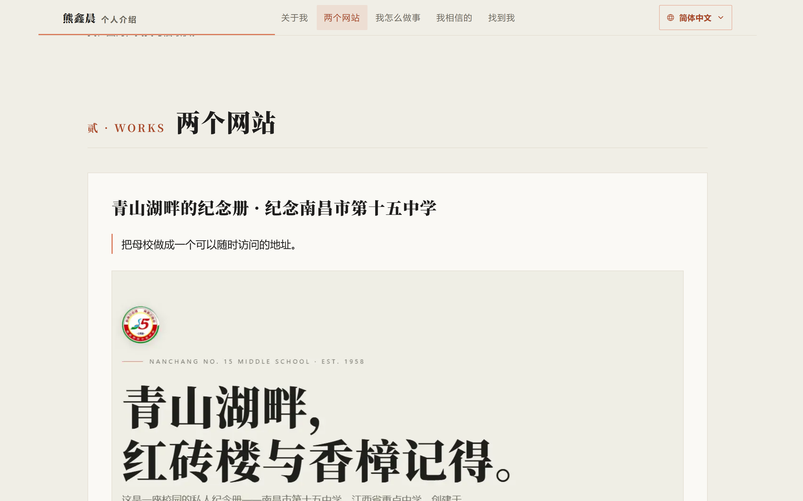

<sub>🌐 <b>中文</b> · <a href="README.en.md">English</a></sub>

<div align="center">

# Introduction of XinChen Xiong · 熊鑫晨的个人介绍站

> *「我还没写出改变世界的代码。」*

[](https://xxc2007.me/)
[](https://github.com/xxc2007/Introduction-of-XinChen-Xiong)
[](LICENSE)
[](#叁--stack-技术栈)
[](#其一--field-首屏粒子场)
[](#肆--local-本地运行)
[](#其二--pages-中英两页)
[](#其三--state-现状与边界)
[](https://www.douyin.com/user/MS4wLjABAAAA-AYW1RCpFjwJmoMTnZy1vKmOQopmBOUjPLN9phlDpjI)
[](https://www.xiaohongshu.com/user/profile/63bac6500000000026006c47)
[](https://space.bilibili.com/31961476)
[](https://x.com/xxc2007)
[](https://www.youtube.com/@xxc2007)

<br>

**把想清楚的事，一件一件做成可以打开的地址。**

<br>

这是熊鑫晨的个人介绍站：**中英两页完整静态文件**、**五个章节**、**两个已经上线的网站**、一页公开的联系方式。首屏那片纸屑粒子场是装饰，不是内容——它只跟着你滚动的快慢改变活跃度，拿不到 WebGL 时退成两圈发丝线，文字一块不少。

纯 HTML / CSS / Vanilla JS，结构·样式·行为三分离（`index.html` + `assets/`），零框架、**没有构建步骤**；Three.js 与衬线字体全部自托管，**仓库里的两页不引用任何外部资源**（线上边缘节点另说，见「其三」那张表下面的注）。克隆下来，`node tools/serve.mjs` 起个静态服务器就能打开。

[在线访问](https://xxc2007.me/) · [壹 特色](#壹--highlights-特色) · [贰 站点结构](#贰--site-map-站点结构) · [叁 技术栈](#叁--stack-技术栈) · [肆 本地运行](#肆--local-本地运行) · [伍 部署与同步](#伍--deploy-部署与同步) · [陆 内容标准](#陆--content-内容标准) · [柒 授权](#柒--license-授权) · [捌 星际历史](#捌--star-history-星际历史) · [设计笔记](docs/design.md) · [迁移手册](docs/migration.md) · [内容出处](docs/content-sources.md)

<br>

<!-- 这排一眼数是读者的入口，不是第二个口径来源：算式、复算命令与"哪些数属于哪一刻"全部归
     下面「其三 · STATE 现状与边界」那张表。改了那张表就同时改这排徽章。 -->

<p><b>一眼数</b></p>

[](https://xxc2007.me/)
[](https://github.com/xxc2007/Introduction-of-XinChen-Xiong)
[](LICENSE)
[](#其三--state-现状与边界)
[](#其三--state-现状与边界)
[](#其二--pages-中英两页)
[](#叁--stack-技术栈)
[](#其三--state-现状与边界)
[](#其三--state-现状与边界)

<sub>2026-10-07 10:25–10:36（+0800）本地实测 · 站点仍在构建，字节与文件数随构建变动 · 线上一切以 xxc2007.me 为准</sub>

</div>

---

<p align="center">
  
</p>
<p align="center"><sub>
  ▲ 壹 · HERO 首屏 · 1440×900 · 米白纸感 + 赤陶橙单线 + 衬线大字，纸屑场只在文字背后
</sub></p>

<p align="center">
  
</p>
<p align="center"><sub>
  ▲ 贰 · WORKS 两个网站 · 1440×900 · scrollspy 高亮与第一张作品卡（卡里那张图就是纪念册自己的首屏）
</sub></p>

<p align="center">
  
</p>
<p align="center"><sub>
  ▲ 叁 · MOBILE 移动端 · 390×844 · 顶栏折两行、五个入口均分，纸屑降到 400 粒
</sub></p>

<details>
<summary><b>图录</b> · 这三张截图是哪来的（URL / 视口 / 日期 / 工具 / 字节）</summary>

| 图 | 标的 | 来源 | 视口 | 像素 | 字节 |
|---|---|---|---|---|---|
| ▲ 壹 | `readme-hero-desktop.png` | `http://localhost:8912/`（仓库工作区，`node tools/serve.mjs`） | 1440×900 @2 | 2880×1800 | 321,551 B |
| ▲ 贰 | `readme-works-desktop.png` | 同上，滚到 `#works` | 1440×900 @2 | 2880×1800 | 434,385 B |
| ▲ 叁 | `readme-hero-mobile.png` | 同上，移动仿真（`mobile:true` + 触摸 + iPhone UA） | 390×844 @3 | 1170×2532 | 243,352 B |

- **拍摄时间**：2026-10-07 10:28–10:32（+0800）。
- **工具**：本机 Chrome 154（`--headless=new`）经 DevTools Protocol 调 `Emulation.setDeviceMetricsOverride` + `Page.captureScreenshot`；同一趟还记下了 `Network` 请求清单，用来算「其三 · STATE」表里那行首屏传输量。
- **为什么拍本地预览而不是线上**：截图要跟这份 README 描述的是同一份字节。`xxc2007.me` 的线上部署滞后于工作区（线上仍是上一次构建的副本），拿它拍会拍到仓库里已经不存在的界面。
- **实拍未修**：三张都是整屏原图，没有拼接、没有样机外壳、没有重绘；文字与配色就是浏览器渲染出来的样子。

</details>

---

## 壹 · HIGHLIGHTS 特色

### 其一 · FIELD 首屏粒子场

- **一张 Three.js 纸屑场**：`Points` + 自定义 `ShaderMaterial`，**1200 / 700 / 400** 三档粒子上限按指针类型与视口宽度取，DPR 钉在 **1.75**，无贴图（每粒在片元着色器里用 `gl_PointCoord` 现算软圆盘）
- **颜色只有四种**：墨、纸、赤陶橙、发丝线；约 **8%** 的粒子落在赤陶橙上，其余压在很低的 alpha 里——它是纸屑，不是烟花
- **确定性生成**：种子 `0x9e3779b9`（`scene.js` 的默认值，`main.js` 不传覆盖），渲染期零 `Math.random`——同一次加载永远同一场纸屑，截图不会漂
- **场强由滚动速度驱动**：`assets/js/main.js` 的 `fieldDrive()` 把 `|Δy|/Δt`（px/ms）映射成 `scene.setEnergy(...)`——基准 **0.34**，每 1 px/ms 加 **0.62**，封顶 **1.0**，插值系数 **0.12**；停手 **90 ms** 后目标回落到基准。着色器里 `uEnergy` 同时管漂移速度（`0.04 + 0.08·uEnergy`）与 alpha 增益（`0.74 + 0.34·uEnergy`）：**读得越快纸屑越活跃，停下来就缓缓落回原样**，不跟手也不吵
- **两条硬降级**：hero 整段划出视口或标签页隐藏就**停掉 RAF**（不是降频）；运行期若 60 帧均值超过 **22ms**，粒子数一次性减半

完整的效果—成本—降级清单在 [docs/design.md](docs/design.md)，那里逐条写了每个动效花掉多少字节、哪一档断点关掉它。

### 其二 · PAGES 中英两页

- **两个完整静态页**：`index.html`（zh-CN，默认）与 `en/index.html`（English），**不是** JS 切词典——每页各有自己的语义内容、`canonical` 与 SEO 元数据
- `hreflang` 三条互指（`zh-Hans` / `en` / `x-default` → 中文），`sitemap.xml` 里 **2** 条 URL，`robots.txt` 由本站拥有整个域名根
- 防漂移不是口号：`node scripts/check-parity.mjs` 钉死 **16** 项结构数量与 **5** 组集合（站内资源 / 图片 / 外链 / 页内锚点 / `id`），中英不等就**跑不过去**

### 其三 · STATE 现状与边界

| 项 | 现值 | 口径（怎么核实的） |
|---|---|---|
| 仓库文件 | 索引与工作区同为 **146** 个 | `git ls-files \| wc -l` = 146；`git ls-files --deleted \| wc -l` = 0；`git ls-files --others --exclude-standard \| wc -l` = 0（11:56 复测：先前那 4 个"已删但留在索引"的项已提交，两个口径重新对齐） |
| 页面 | **3** 个 HTML（zh / en / 404） | `git ls-files '*.html' \| wc -l` = 3 |
| 章节 | **5** 节（ABOUT / WORKS / HOW / BELIEFS / CONTACT），`<section>` **6** 个 | `node scripts/check-parity.mjs` 打印的 `h2=5 section=6` |
| 已上线作品 | **2** 个：纪念册 `/nc15/`、GEOHOT `/geohot/` | 两个地址都在页面上有入口；路由见 [贰](#贰--site-map-站点结构) |
| 社媒入口 | **7** 个（个人站 / GitHub / 抖音 / 小红书 / B站 / X / YouTube） | 同一命令的 `social li=7` |
| 中英两页字节 | **19.6 KB / 19.9 KB**（`20,110` / `20,334` B） | `wc -c index.html en/index.html` |
| 全站 CSS | **31.1 KB**（`31,806` B）· gzip **11.0 KB** | `wc -c assets/css/style.css` · `node -e` 里 `zlib.gzipSync` |
| 首屏 JS（含 Three.js） | gzip **189.3 KB** / 上限 195.3 KB | `node scripts/check-bytes.mjs`（自有 JS gzip + `assets/vendor/` gzip） |
| 自托管 Three.js | `three.module.min.js` **338,908** B → gzip **79,328** B；`three.core.min.js` **381,124** B → gzip **101,305** B | `wc -c assets/vendor/*.js` · `node -e` 里 `zlib.gzipSync` |
| 自托管衬线切片 | **101** 片 woff2，合计 **6,027,992** B；`wght.css` 里 **101** 条 `@font-face` | `find assets/fonts -name '*.woff2' \| wc -l`（切片在 `…/noto-serif-sc/files/`，直接 `ls assets/fonts/noto-serif-sc/*.woff2` 数到的是 0）· `grep -c '@font-face' assets/fonts/noto-serif-sc/wght.css` |
| 图片（头像 + 两张作品截图） | **85.8 KB**（`87,886` B）/ 上限 87.9 KB → `BUDGET OK` | `wc -c assets/images/avatar.jpg assets/images/shot-nc15.webp assets/images/shot-geohot.webp`（`avatar.jpg` 26,762 + `shot-nc15.webp` 28,624 + `shot-geohot.webp` 32,500） |
| 首屏总传输量 | **1,493.6 KB ≈ 1.46 MB**，**27** 个请求：文本 gzip **251.2 KB** + 首屏真正拉到的 **17** 片 woff2 **1,214.1 KB** + 图片 **28.3 KB** | 本机 Chrome headless 起一趟 CDP `Network` 事件流记全请求，文本按 `zlib.gzipSync`、woff2 与图片按原字节累加（与「图录」里那三张截图同一趟） |
| 不进首屏的分享素材 | **78.7 KB**（`80,541` B）/ 上限 195.3 KB | `wc -c assets/images/banner.svg assets/images/og-card.svg assets/images/og-card.png assets/images/favicon.ico assets/images/favicon-32.png` |
| 仓库内外部资源引用 | **0** | `grep -c 'src="https://' index.html en/index.html` → 两页都是 `0`；`grep -oE 'https?://[a-z0-9.-]+' index.html \| sort -u` 里只有 canonical、JSON-LD 的 `schema.org` 与外链目标，没有一样是可请求资源。**这条数的是仓库源码；线上边缘会另注入，见下方「外部请求」边界注** |
| 构建步骤 | **0**（仓库里没有构建清单） | `git ls-files '*.json' \| wc -l` → `0` |
| 仓库体积 | 工作区 **7.93 MiB**（不含 `.git/`）· `.git` **6.91 MiB** | `du -sb --exclude=.git .` = `8,314,693` · `du -sb .git` = `7,249,147` |
| 域名根归属 | 目标 `/` = 本站；**已切换**：`/` = 本站、`/nc15/` = 纪念册 | 仓库记录 `bash scripts/switch-routes.sh` 于 2026-10-07 09:44:51 (+0800) 执行；本次 10:30 复测 `curl -o /dev/null -w '%{http_code}'`：`/` 200、`/en/` 200、`/nc15/` 200、`/geohot/` 200、`/comment/` 302（Artalk 自己跳到 `/comment/sidebar/`） |

<!-- 已核对：2026-10-07 10:25–10:36 (+0800) 本机重算全部数字；线上状态码是 10:30 那趟 curl 的实测。 -->

字节与文件数会随构建变动：这张表是 **2026-10-07 10:25–10:36 (+0800)** 的一次快照，改代码的那位改完就得重跑一遍。预算类数字的**唯一出处是 `node scripts/check-bytes.mjs`**，本表只作快照，改阈值请改脚本而不是改这里。

> **「外部请求 0」的边界（不可省略）**：上面那格数的是**仓库里的两页源码**——`index.html` / `en/index.html` 不写任何第三方 `src`/`link`，Three.js 与衬线字体全部自托管。但站点跑在 Cloudflare 之后，**边缘节点会往响应里注入本站源码之外的东西**：2026-10-08 从公网 `curl` 首页，返回体里带着 `https://static.cloudflareinsights.com/beacon.min.js`（Cloudflare Web Analytics 的取数脚本，属访客侧埋点）和 `/cdn-cgi/scripts/*/email-decode.min.js`（邮箱混淆）。这两样都不由本仓库引用、也不受本仓库控制——**「零外部请求 / 无埋点」只对仓库成立，对线上不成立**。要真正做到线上零第三方，得在 Cloudflare 侧关掉 Web Analytics 与 Email Obfuscation，那是边缘配置，不在这个仓库里。


科研与学业细节不进这个站，也不进这份 README——边界写在 [陆 · 内容标准](#陆--content-内容标准)。

## 贰 · SITE MAP 站点结构

```text
Introduction-of-XinChen-Xiong/
├── index.html              # 简体中文页（默认）；两处内联：noscript 降级样式 + JSON-LD Person
├── en/index.html           # English page（完整译文，非运行时翻译；assets 以 ../ 相对路径共用）
├── 404.html                # 零脚本 404：共用外链样式与字体，另有一段只服务本页两个类的内联兜底；四个已上线地址列成一排入口
├── assets/
│   ├── css/style.css       # 全站样式：设计令牌 + 组件 + 6 条 @media（4 档断点 + 无脚本 + 减弱动效）
│   ├── js/main.js          # 主交互：揭示/进度/scrollspy/语言菜单/纸屑场随滚动速度取能/复制邮箱/磁吸与卡片倾斜，全站共用一条 rAF 链
│   ├── js/scene.js         # Three.js 纸屑场（导出 initField(canvas)，把 uEnergy 交给 main.js），建不出来就抛错让 main.js 兜底
│   ├── vendor/             # 自托管 Three.js 两个文件，零 CDN，文件头 license 注释保留
│   ├── fonts/noto-serif-sc/# 自托管可变衬线：wght.css（101 条 @font-face）+ files/ 101 片，按 unicode-range 惰性拉
│   └── images/             # 头像 jpg、两张作品截图 webp、banner.svg、og-card（svg + png 1200×630）、favicon 三枚、本 README 的三张配图（实测清单挪到 `docs/image-provenance.md`，不再随站点发布）
├── scripts/                # check-parity · check-links · check-bytes · deploy.sh · verify-sync.sh · switch-routes.sh
├── tools/                  # serve.mjs 本地预览（把纪念册挂到 /nc15/）· gh-publish.mjs 备用发布通道 · normalize-cf.mjs Cloudflare 改写归一化
├── deploy/                 # nginx.conf.example（占位符示例；真实生效文件在服务器 /etc/nginx 下）
├── docs/                   # build-contract · site-spec · design · migration · content-sources
├── README.md / README.en.md
├── robots.txt / sitemap.xml / LICENSE / .gitattributes / .gitignore
└── .deploy.env             # 部署目标（主机 / 登录名 / 密钥路径）——已 gitignore，绝不入库
```

路由是共享域名的关键，四个前缀各有归属：

| 路径 | 归谁 | 为什么这么放 |
|---|---|---|
| `/` 与 `/en/` | **本站**（中文默认 + English） | 介绍站是域名门牌，`x-default` 也指 `/` |
| `/nc15/` | 纪念册（物理目录 `/var/www/nc15`） | 从域名根搬进来，站内绝对路径已带 `/nc15` 前缀 |
| `/geohot/` | GEOHOT（反代到本机 Node 服务） | 前缀与优先级都要保持 `^~`，它有自己的后端 |
| `/comment/` | Artalk 留言墙后端 | **必须留在域名根**——纪念册的 `wall.js` 用根绝对路径调它，跟着搬进 `/nc15/comment/` 会让留言墙整块失效 |

nginx 的完整写法见 [`deploy/nginx.conf.example`](deploy/nginx.conf.example)，搬迁与回滚见 [docs/migration.md](docs/migration.md)。

## 叁 · STACK 技术栈

| 层 | 选型 | 为什么 |
|---|---|---|
| 前端 | 纯 HTML / CSS / Vanilla JS，结构·样式·行为三分离，零框架无构建 | 页面只有一屏半，框架的成本换不回收益；无构建意味着仓库里的字节就是线上字节，四方逐字节核验才有意义 |
| 三维 | Three.js **自托管**（`assets/vendor/`，两个文件），不依赖 CDN | 断网、代理、CDN 抽风都不影响首屏；仓库里就能审计 license |
| 字体 | 自托管 Noto Serif SC **可变**切片（`font-weight: 200 900`）→ Georgia → 宋体族 | 101 片按 `unicode-range` 只拉用到的那几片（首屏实测 17 片）；远端字体一挂就退到系统衬线，页面不塌 |
| 双语 | 两个完整静态页 + `hreflang`，不用 JS 运行时翻译 | 每页 own 自己的语义与 SEO 元数据；机器翻译插件会污染正文 |
| 服务 | nginx（`/` 静态 + `/nc15/` alias + 两条反代） | 四个前缀的优先级只有 nginx 配置里说得清楚 |
| 部署 | `git archive HEAD` 上服务器 · Cloudflare 在前 · Let's Encrypt 证书 | 走仓库 blob 字节而不是工作区字节，CRLF 之类的坑不会出现在核验里 |

## 肆 · LOCAL 本地运行

### 其一 · NO BUILD 没有构建步骤

**没有构建步骤**——仓库里的文件就是浏览器要加载的文件，没有打包、没有转译、没有依赖安装，
`git ls-files '*.json' | wc -l` 数出来是 **0**。也不要 `python -m http.server`：本站的文档从不在本机假设有 Python
（实测这台机器 `python` 与 `python3` 都直接报 "Python was not found"），可用的本地服务只有一条：

```bash
git clone https://github.com/xxc2007/Introduction-of-XinChen-Xiong.git
cd Introduction-of-XinChen-Xiong
node tools/serve.mjs            # 默认端口 8899，只监听本机回环地址
```

### 其二 · PORTS 端口被占了怎么办

换一个写死的空闲端口（别 `kill` 别人的进程）：

```bash
netstat -ano | grep LISTENING | grep -E ':8[89][0-9][0-9]'   # 先看谁在听（含 88xx 与 89xx：8890 / 8899 都在这个范围）
node tools/serve.mjs 8907                                 # 用没被占的端口
```

2026-10-07 实测跑通（Node `v24.19.0`）：`/` `/en/` `/assets/css/style.css` `/assets/js/main.js` `/assets/vendor/three.module.min.js` `/assets/fonts/noto-serif-sc/wght.css` 全部 **HTTP 200**，`/nc15/` **200**（预览器把纪念册仓库挂在这个前缀上，找不到就诚实 404），不存在的 `/nope.html` 是 **404**；`curl` 取回的 `/` 与磁盘上的 `index.html` 逐字节相等。验证完用 `taskkill //PID <pid> //F //T` 关掉，再确认端口回到 FREE。

### 其三 · FILE 直接双击能到什么程度

> 直接双击 `index.html`（`file://`）能读到全部文案与样式，但 `<script type="module">` 会被本地跨源策略拦掉——动效、语言菜单都不跑，粒子场拿不到，退成静态发丝底纹。**这不是坏掉的站点**：内容一直可读，脚本只是增强。留言墙在 `/comment/`，本站不调它，离线预览也因此跟它无关。

## 伍 · DEPLOY 部署与同步

### 其一 · ONE COMMAND 一条命令，五步走完

一条命令，五步走完：

```bash
cp .deploy.env.example .deploy.env   # 填 DEPLOY_HOST=<server-ip> / DEPLOY_USER=<ssh-user> / DEPLOY_KEY
bash scripts/deploy.sh "改了首屏那行 motto"
```

1. **质量闸门**——`check-parity.mjs`（中英对齐）、`check-links.mjs`（链接可达 + 主机信息红线）、`check-bytes.mjs`（字节预算），再对 `scripts/*.sh` 做 `bash -n`、对 `tools/*.mjs` 做 `node --check`。跑不过就不提交。
2. **提交并推 GitHub**——工作区有改动时**不用 `git add -A`**，而是 `git add -u` 加上按目录白名单逐项 `git add`（`index.html en 404.html robots.txt sitemap.xml assets docs deploy scripts tools LICENSE README.md README.en.md .gitignore .gitattributes`）；任何落在这份清单之外的未跟踪文件会被列出来提醒、但不提交。之所以这么写：`git add -A` 曾把一个核查代理落在仓库根的临时产物 `wall2.json` 连着推进了公开仓库——临时产物就该留在仓库外，不靠"顺手一起提交"进主干。说明没有 conventional 前缀时自动补 `update:`，`git push` 重试 3 次。
3. **上服务器**——`git archive --format=tar HEAD` 只把 `index.html en 404.html robots.txt sitemap.xml assets` 六项按 **仓库 blob 字节**打到 `~/deploy-intro`，逐项 `rm -rf` + `cp -r` 进 `DEPLOY_ROOT`，最后 `chown -R www-data:www-data`。走 blob 而不是工作区，是为了让 CRLF 之类的工作区差异不可能混进核验。
4. **四方逐字节核验**——`bash scripts/verify-sync.sh`。
5. **线上可达性**——从服务器本机带 `Host` 头请求回环地址，逐个前缀回状态码。

### 其二 · PARITY 四方逐字节核验

`verify-sync.sh` 证明的是**四个来源的字节同时成立**（分五段跑），不是"我看到页面能开"：

| 段 | 比的是 | 怎么比 |
|---|---|---|
| A | 本地 HEAD ↔ 服务器文件 | 部署集内每个文件两侧各算 `sha256`，排序后整串相等才算过 |
| B | 本地 HEAD ↔ GitHub 仓库树 | 先比 tree hash；不同就逐个 blob 比（git blob sha 与 GitHub blob sha 同源可直接对）；README/docs 等非部署文件不计 |
| C | 本地 ↔ **源站**（绕过 CDN） | 在服务器上带 `Host` 头请求本机回环地址，取回再算 `sha256`——**这一条是逐字节的**，不给缓存任何借口 |
| D | 本地 ↔ 公网（经 Cloudflare） | 抓 `/` 与 `/en/` 两条流，比对前先归一化掉 Cloudflare 的邮箱混淆（它会把 `mailto:` 换成受保护链接并注入 `email-decode.min.js`——那是站点级功能，不是缓存陈旧），再算 `sha256` |
| E | 邻站未受影响 | `/nc15/` 与 `/geohot/` 必须仍是 200 |

C 与 D 分开是刻意的：**C 抓的是"部署对不对"，D 抓的是"CDN 有没有喂旧副本"**；
合成一条就会被 Cloudflare 的改写搞出假性差异。归一化规则写在 `tools/normalize-cf.mjs`，与 D 段里的 `sed` 一一对应。

### 其三 · FALLBACK 备用发布通道

**备用发布通道**：本机 `git push` 走 HTTPS 常因代理 TLS 抖动失败，这时 `deploy.sh` 自动改跑 `node tools/gh-publish.mjs "说明"`——它用 GitHub Git Data API 把本地 HEAD 那棵树当**一个原子提交**推上去（逐文件建 blob → 建 tree → 建 commit → `refs/heads/main` 以 `force: false` 前移）。推送失败绝不能留下半个提交。

### 其四 · SECRETS 仓库里永远没有主机信息

源站 IP、SSH 登录名、私钥路径只存在于 gitignore 的 `.deploy.env`（`.gitignore` 第 10 行），示例一律只出现 `<server-ip>` / `<ssh-user>` 占位符；这条不靠自觉——`check-links.mjs` 会扫全部跟踪文件的每一行，命中真实 IP、SSH 私钥参数、私钥文件名或登录名就**让构建失败**（只有回环与通配监听地址在白名单里——它们不指向任何一台机器）。

### 其五 · ROUTES 域名根切换是另一条命令

```bash
bash scripts/switch-routes.sh --dry-run   # 只读：打印 diff，不写任何东西
bash scripts/switch-routes.sh             # 备份 → nginx -t 预检 → 重载；预检不过自动还原
bash scripts/switch-routes.sh --rollback  # 还原最近一次备份
```

已于 **2026-10-07 09:44:51 (+0800)** 执行 `bash scripts/switch-routes.sh`。本次 **10:30** 从公网复测：`/` 200（介绍站）、`/en/` 200、`/nc15/` 200（纪念册）、`/geohot/` 200、`/comment/` 302（Artalk 跳到自己的 `/comment/sidebar/`）、`/robots.txt` 200、`/sitemap.xml` 200；`/` 与 `/en/` 的 `<title>` 分别是「熊鑫晨 · Introduction of XinChen Xiong」与「Xiong Xinchen · Introduction of XinChen Xiong」。备份留在 `/etc/nginx/sites-available/xxc2007.me.bak-nc15-20261007-094451`，回滚一条命令：`bash scripts/switch-routes.sh --rollback`。

## 陆 · CONTENT 内容标准

这个站只写**已经上线、且有地址可指**的东西。允许出现在页面上的每一句事实，来源只允许三类：GitHub 个人主页 README、两个已上线网站自身、两个仓库 README——不推断、不补全、不美化。

- 所在地只写 `China`（profile 原文）；学校的定位坐标不是他的住址，不进任何文案
- 邮箱来自 GitHub 主页的公开元数据；写它是因为它公开过，不是因为它可以随便改
- 学术与学业细节、社交平台的粉丝与星数，一律不当成就写
- 上游框架的名字不进他的署名

每条文案的来源与核实日期都在 [docs/content-sources.md](docs/content-sources.md)——**改文案之前先读那张表**。视觉与动效的取舍写在 [docs/design.md](docs/design.md)，新机器上手写在 [docs/migration.md](docs/migration.md)。

## 柒 · LICENSE 授权

[MIT](LICENSE) © 2026 熊鑫晨（Xiong Xinchen）· 头像与两张作品截图 © 熊鑫晨 · Three.js 以 MIT 随仓库自托管（`assets/vendor/`，文件头 license 注释保留）

## 捌 · STAR HISTORY 星际历史

<p align="center">
  
</p>
<p align="center"><sub>
  ▲ 曲线由 <a href="https://star-history.com">star-history.com</a> 动态生成，星数一变曲线就跟着长（GitHub 走图片代理缓存，更新会有几小时延迟）；仓库还年轻，这条线会从第一个星标开始有内容。
</sub></p>

---

<div align="center">
  <sub>献给每一个把想清楚的事做成地址的人。<br>编辑标准与代码 · 熊鑫晨 · <a href="https://xxc2007.me/">xxc2007.me</a> · 2026<br><a href="docs/design.md">docs/design.md</a> · <a href="docs/migration.md">docs/migration.md</a> · <a href="docs/content-sources.md">docs/content-sources.md</a></sub>
</div>
